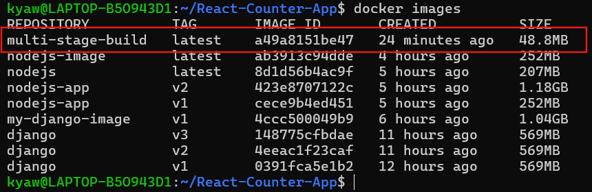
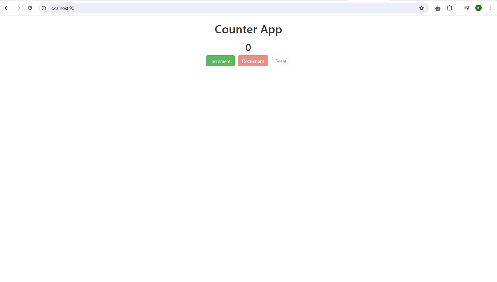

# Docker image multi-stage build for React Counter App

Clone the app.

```bash
$ git clone https://github.com/Goodiec/React-Counter-App.git
```

Create Dockerfile as multi-stage build

```docker
# First stage - Building the application
# Use node:16-a;pine image as a parent image
FROM node:16-alpine AS build

# Create app directory
WORKDIR /usr/src/app

# Copy package.json files to the working directory
COPY package*.json ./

# Install app dependencies
RUN npm install

# Copy the source files
COPY . .

# Build the React app for production
RUN npm run build

# Second stage - Serve the application
FROM nginx:alpine

# Copy build files to Nginx
COPY --from=build /usr/src/app/build /usr/share/nginx/html
EXPOSE 80
CMD ["nginx", "-g", "daemon off;"]
```

The Dockerfile now has two stages or steps (characterized by the `FROM` statements). This will create a two-stage build process: the first stage builds the React application, and the second stage will serve the built application using Nginx. The `COPY` command in the second stage copies the contents of the `build` directory from the first stage (alias "build") into the Nginx web server default directory. This sets up Nginx to serve your React application.

Build Docker image

```bash
$ docker build -t multi-stage-build .
```

Check Docker image size and it is only 48.8 MB.



Run the Docker container.

```bash
$ docker run -d -p 80:80 multi-stage-build

```

Access the React Counter App on browser.

